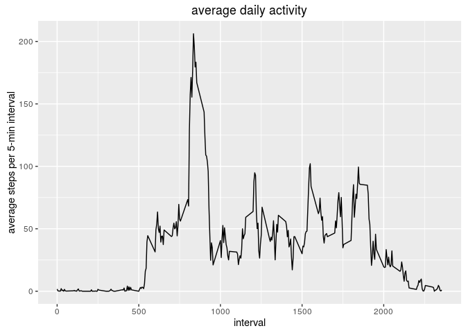
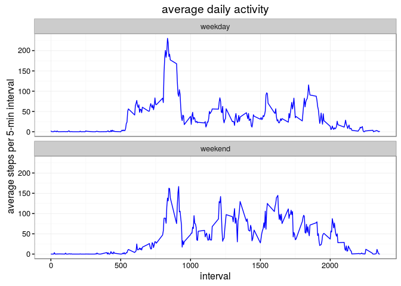

# Reproducible Research: Peer Assessment 1
Jinsong Zhang  
9/11/2016  

## Loading and preprocessing the data


```r
if (!exists("activity.csv")){
unzip("activity.zip")} # decompress zip if not exists
activity<-read.csv("activity.csv")
#remove any rows with missing step values (NA)  
activity<-activity[!is.na(activity$steps),]
```


## What is mean total number of steps taken per day?

```r
library(dplyr)
```

```
## 
## Attaching package: 'dplyr'
```

```
## The following objects are masked from 'package:stats':
## 
##     filter, lag
```

```
## The following objects are masked from 'package:base':
## 
##     intersect, setdiff, setequal, union
```

```r
library(ggplot2)
library(timeDate)

#Calculate the total number of steps taken per day
total_steps_per_day=activity%>%group_by(date)%>%summarise(total_steps=sum(steps))
#Histogram of the total number of steps taken each day
gg=ggplot(total_steps_per_day,aes(x=total_steps))
gg+geom_histogram(colour="black", fill="white")+
  labs(title="histogram of total steps per day (without missing data)",
       x="total stpes per day")
```

```
## `stat_bin()` using `bins = 30`. Pick better value with `binwidth`.
```

<!-- -->

```r
mean_total_steps_per_day=mean(total_steps_per_day$total_steps)
# mean total steps per day
print(mean_total_steps_per_day)
```

```
## [1] 10766.19
```

```r
median_total_steps_per_day=median(total_steps_per_day$total_steps)
# median total steps per day
print(median_total_steps_per_day)
```

```
## [1] 10765
```

## What is the average daily activity pattern?

```r
#Time series plot of the average number of steps taken
mean_steps_per_interval=activity%>%group_by(interval)%>%summarise(mean_steps_per_interval=mean(steps))
g<-ggplot(mean_steps_per_interval,aes(x=interval,y=mean_steps_per_interval))+
  labs(title="average daily activity",y="average steps per 5-min interval")
g+geom_line()
```

<!-- -->

```r
# Sort activities in the descending order
ordered<-mean_steps_per_interval%>%arrange(desc(mean_steps_per_interval))

# Which 5-minute interval, on average across all the days in the dataset,contains the maximum number of steps?
ordered$interval[1]
```

```
## [1] 835
```


## Imputing missing values

```r
activity_na<-read.csv("activity.csv")

row_is_na<-apply(activity_na, 1, function(x) any(is.na(x)))
# Calculate and report the total number of missing values in the dataset (i.e. the total number of rows with NAs)
print(sum(row_is_na))
```

```
## [1] 2304
```

```r
# replacing NA (missing values) with the mean of corresponding 5-min intervals
activity_new<-activity_na %>% group_by(interval) %>% mutate(steps = ifelse(is.na(steps),
                                                        mean(steps,na.rm=T), steps))

# re-calculate total steps per day
total_steps_per_day=activity_new%>%group_by(date)%>%summarise(total_steps=sum(steps))
# Histogram of the total number of steps taken each day after missing values are imputed
gg=ggplot(total_steps_per_day,aes(x=total_steps))
gg+geom_histogram(colour="black", fill="white")+
  labs(title="histogram of total steps per day (with missing data)",x="total steps per day")
```

```
## `stat_bin()` using `bins = 30`. Pick better value with `binwidth`.
```

<!-- -->

```r
mean_total_steps_per_day=mean(total_steps_per_day$total_steps)
# mean total steps per day
print(mean_total_steps_per_day)
```

```
## [1] 10766.19
```

```r
median_total_steps_per_day=median(total_steps_per_day$total_steps)
# median total steps per day
print(median_total_steps_per_day)
```

```
## [1] 10766.19
```
- Do these values differ from the estimates from the first part of the assignment? 

     Mean was not affected. Median was slightly increased (from 10765 to 10766.19).

- What is the impact of imputing missing data on the estimates of the total daily number of steps?

     Imputing missing values resulted in additional days with average total steps (10766.19).


## Are there differences in activity patterns between weekdays and weekends?

```r
activity_new_wkd<-activity_new%>%mutate(wkd=ifelse(isWeekend(date),"weekend","weekday"))
activity_new_wkd$wkd<-factor(activity_new_wkd$wkd)
activity_wkd_weekday=activity_new_wkd%>%group_by(wkd,interval)%>%
  summarise(mean_steps_per_interval=mean(steps))
# Panel plot comparing the average number of steps taken per 5-minute interval across weekdays and weekends
g<-ggplot(activity_wkd_weekday,aes(x=interval,y=mean_steps_per_interval))+
  labs(title="average daily activity",y="average steps per 5-min interval")
g+geom_line(col="blue")+facet_wrap(~wkd,ncol=1)+theme_bw()
```

<!-- -->

